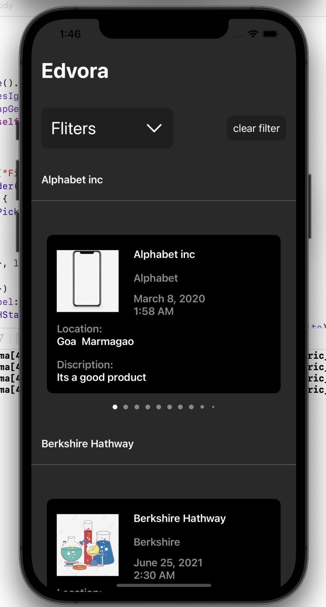
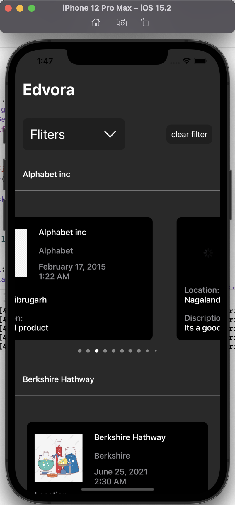
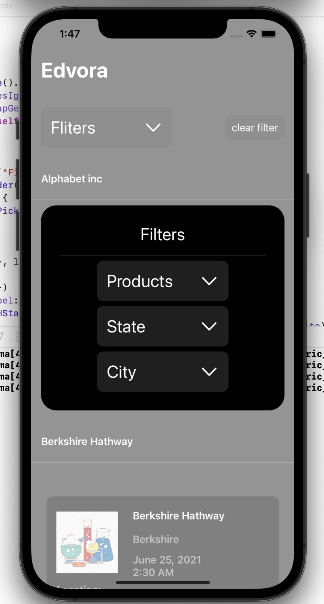
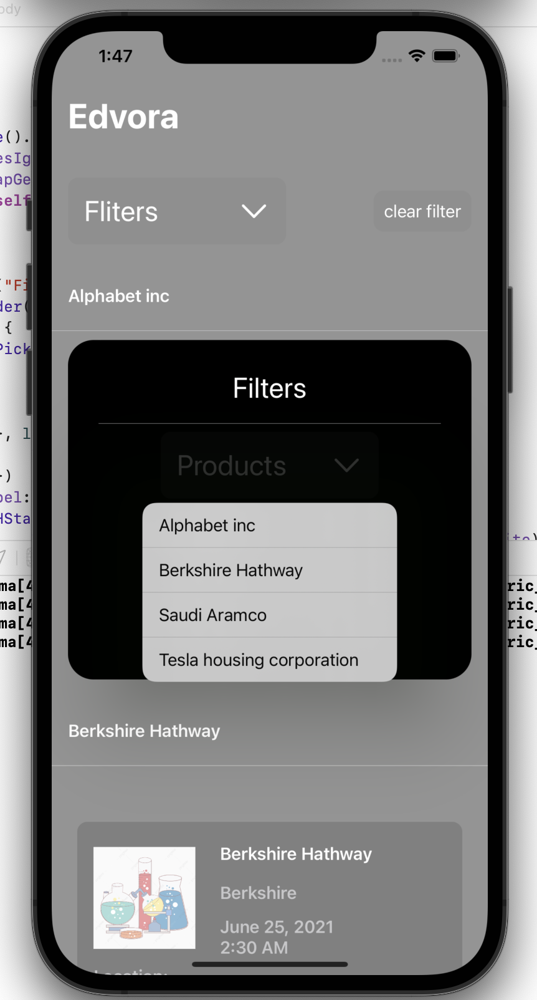
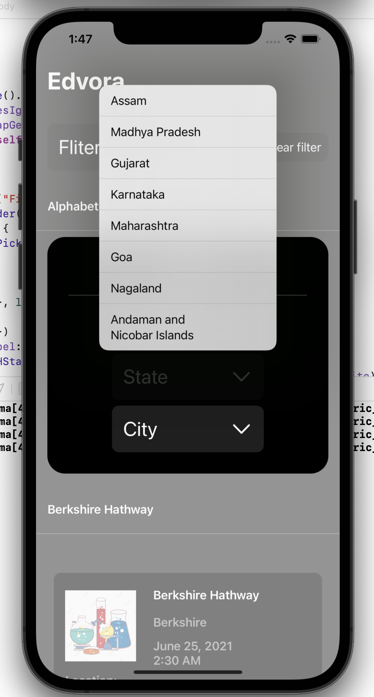
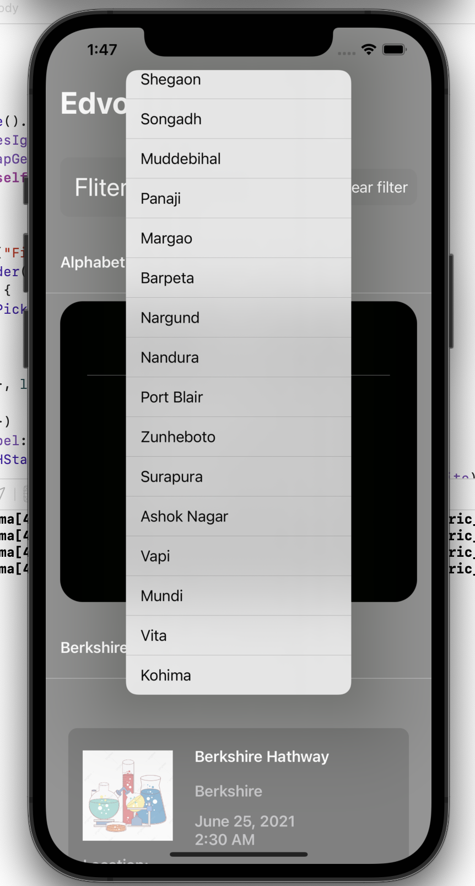

# Figma
Mobile IOS App created for intern at Edvora

Home Page Screenshot

You can intereact to the UI

Filter function

select product

select state

select city

Todo: implement filter for state and city selection
